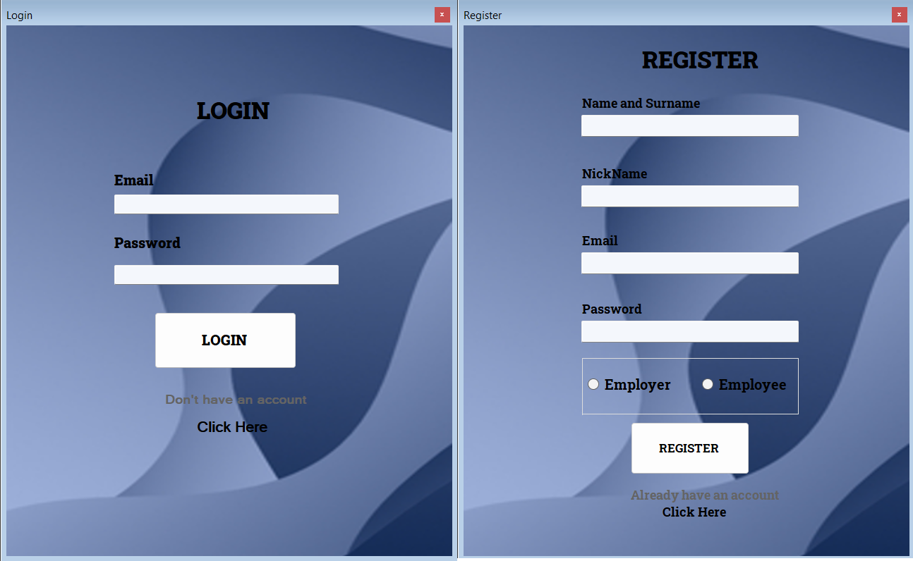

# My Job App Project

## 📋 About the Project
This project aims to help workers and employers manage their job-related information efficiently and systematically. **[My Job]** provides distinct features for each user type: Workers and Employers.

Through a combined login and register page, users can sign up or log in to access their respective panels to manage their job details easily.

### Employer Features
- Update personal information.
- Register workers interested in joining their business based on daily or monthly income.
- Manage salary information of workers.
- Make payments to workers and upload daily earnings to the system.

### Worker Features
- Update personal information.
- Join a job offered by an employer.

---

## 📸 Screenshots
Add the corresponding images in the placeholders below by uploading the PNG files.

### Login and Register Page Screenshot

### Worker Panel Screenshot

### Employer Panel Screenshot

